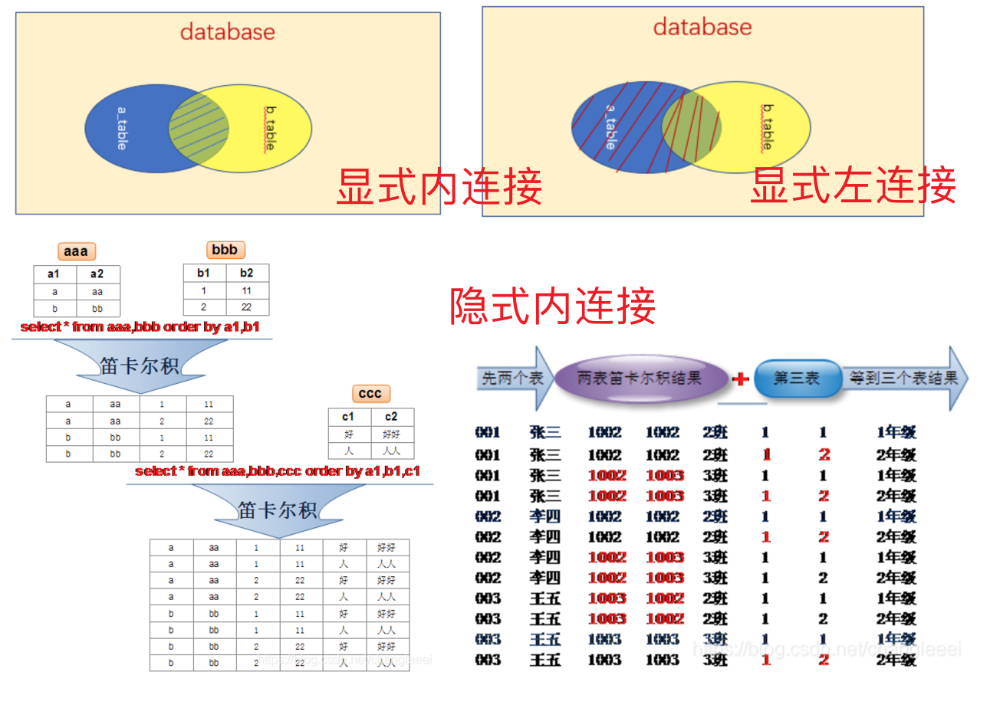

- 对应的项目project1

# MySQL安装

[mac系统下MySQL安装](https://www.jianshu.com/p/2865c84a9fe6)

SQL=Structured Query Language结构化查询语言，关系型数据库

注意事项：在添加PATH环境变量的时候使用`:`作为分割符

账户：`root`

密码：`root1423`

MySQL登陆：`mysql -uroot -p`然后输入密码

登陆远程MySQL：`mysql -hIP地址 -uroot -p密码`

MySQL目录结构：

# SQL语法

```sql
show databases;#查询数据库

```

sql语法不区分大小写

### MySQL CRUD

SQL语言的分类：

DDL：用来操作数据库和表

DML：用来增删改数据库中表的**数据**

DQL：用来查询数据库中表的数据

DCL：用来控制

# DDL操作数据库和表

### 操作数据库

增加(Create)、检索(Retrieve)、更新(Update)和删除(Delete)

- Creat

```sql
create database 数据库名称;#创建新的数据库
create database if not exists数据库名称;
create database 数据库名称 character set gbk;#创建新的数据库，并指定字符集
```

- Retrieve

```sql 
show databases;#查询所有数据库的名称
show create database 数据库名称#查询数据库的字符集utf8
```

- Update

```sql
alter database 数据库名称 character set 字符集名称;#修改数据库字符集名称
```

- Delete

```sql
drop database 数据库名称;#删除数据库
```

- 使用

```sql
select database();#查询当前正在使用的数据库名称 
use 数据库名称;#使用数据库
```

### 操作表

也是增删改查

- Creat创建

```sql
create table 表名(
	列名1 数据类型1,	列名2 数据类型2,....,	列名n 数据类型n
);
数据类型：
	int 整数类型，如age int
	double 小数类型，如score double(5,2),表示一共五位数，其中小数占两位。
	date yyyy--MM--dd#日期
	datetime yyyy-MM--dd HH:mm:ss#时间
	timestamp yyyy-MM--dd HH:mm:ss#时间戳类型
	varchar #字符串类型，使用方法如：name varchar(20)，其中20表示最大字符长度
例子：
	create table student(
  	id int,
    name varchar(20),
    age int,
    score double(4,1),
    birthday date,
    insert_time timestamp
  );
  
复制表：
create table 表名 like  被复制的表名;
```

- Retrieve查询

```sql 
show tables;#查询某个数据库中所有表的名称
desc 表名称;#查询表结构，desc表示description
```

- Update改

```sql
alter table 表名 rename to 新的表名;#修改表名
show create table 表名;#查看表的字符集
alter table 表名 character set 字符集名;#修改表的字符集，就是utf8或者gbk
alter table 表名 add 列名 数据类型;#添加一列
alter table 表名 change 老列名 新列名 新数据类型;#修改列名称 数据类型
alter table 表名 modify 列名 新的数据结构;#只修改数据类型
alter table 表名 drop 列名;#删除一列
```

- Delete删除

```sql
drop table 表名;#删除数据库
drop table if exists 表名;#删除前先判断一下是否存在。
```

# DML增删改表中的数据

- 添加数据

```sql
insert into 表名(列名1,列名2,...,列名n) values(值1,值2,...,值n);
#字符和日期要用“”或者是‘’包起来
```

- 删除数据

```sql
delete from 表名 [where 条件];
#例如
delete from student where id=1;
#如果不加条件，则会删除表中所有纪录
truncate table 表名;#truncate截断，作用是清空表，建议使用这个方法

```

- 修改数据

```sql
update 表名 set 列名1=值1,列名2=值2,列名3=值3 [where 条件]
如：
update 表名 set age=15 ,score=99 where id=12;
注意：如果不加任何条件表中的所有行的数据都会被修改。
```


# DQL查询表中数据

语法格式

```sql
select 字段列表 from 表名 where 条件 group by 分组 having 分组之后的条件 order by 排序 limit 分页限定；#
```

### 基础查询：

```sql
select * from 表名;#查询表中所有数据，*表示所有
select name,age from 表名;#查询name和age
select distinct  字段 from 表名;#去除查询到的重复的内容
SELECT name,Math_score,English_score, Math_score+English_score FROM Person;#查询姓名，数学成绩，英语成绩，并计算总成绩
#如果计算结果有null则把null替换为0 
SELECT name,Math_score,IFNULL(English_score,0), Math_score+IFNULL(English_score,0) FROM Person;
#起别名  
SELECT name,Math_score as 数学,IFNULL(English_score,0) as 英语, Math_score+IFNULL(English_score,0) FROM Person;
```

### 条件查询：

```sql
where 子句后跟条件

>,<,>=,<=,=,<>
BETWEEN...AND
IN(集合)
IS NULL
and &&
or ||
not !d
LIKE#是模糊查询，就是正则表达式
_  表示单个任意字符
%  表示多个任意字符
```

具体实例：

```sql
SELECT * FROM Person;
SELECT * FROM Person WHERE age>20;# 查询年龄大于20岁的 
SELECT * FROM Person WHERE age>=20 AND age<=25; #等价于上面的语句 
SELECT * FROM Person WHERE age BETWEEN 20 AND 25 ;# 查询年龄在20岁和25岁之间的人，包含20和25 

SELECT * FROM Person WHERE age=23 OR age=24 OR age=25;#查询年龄是23或者24或者25的人 
SELECT * FROM Person WHERE age IN(21,22,23,24);#查询年龄在21,22,23,24的人

SELECT * FROM Person WHERE age>20 AND Math_score>90;# 查询年龄大于20岁的并且成绩高于90分的 

SELECT * FROM Person WHERE English_score IS NULL;#查询英语成绩为null的纪录 
SELECT * FROM Person WHERE English_score IS NOT NULL;#查询英语成绩不为null的纪录 

SELECT * FROM Person WHERE `name` LIKE "张%";#查询以姓张的数据
SELECT * FROM Person WHERE `name` LIKE "_书_";#查询第二个字为书的数据

#用case when
#方法1
SELECT
	id,
CASE
		WHEN p_id IS NULL THEN "Root" 
		WHEN id NOT IN ( SELECT p_id FROM tree ) THEN"Leaf" 
		ELSE "Inner" END 
		AS Type 
FROM
	tree
#方法2
SELECT category_id,
CASE case_value
	WHEN when_value THEN
		statement_list
	ELSE
		statement_list
END 
FROM
category;
```

### 排序查询：

```sql
ascending=ASC
desending=DESC

SELECT * FROM Person ORDER BY Math_score;#默认按照升序排列ASC
SELECT * FROM Person ORDER BY Math_score DESC,age ASC;#表示先按数学成绩排名，当成绩一样的时候再按年龄排名
```

### 聚合函数

聚合函数是将一列数据作为一个整体，进行纵向计算。

```sql
count#表示计算数量的函数
max#计算最大值
min#计算最小值
sum#求和
avg#计算平均值
⚠️聚合函数的计算会排除null，如果也要包含null的话可以使用
```

实例：

```sql
SELECT * FROM Person ORDER BY Math_score;#默认按照升序排列ASC
SELECT * FROM Person ORDER BY Math_score DESC,age ASC;#表示先按数学成绩排名，当成绩一样的时候再按年龄排名

SELECT COUNT(`name`) FROM Person;# 计算name数据的总个数，不包含null
SELECT COUNT(ISNULL(`name`)) FROM Person;#如果是null的话，替换为0，这样就可以统计包含null的数据的个数

SELECT MAX(English_score) FROM Person;#统计英语最高分
SELECT MIN(English_score) FROM Person;#统计英语最低分

SELECT SUM(English_score) FROM Person;#统计英语总分
SELECT AVG(English_score) FROM Person;#统计英语平均分
```

### 分组查询

语法：group by

```sql
SELECT sex ,SUM(English_score) FROM Person GROUP BY sex;#计算男组和女组的总成绩
SELECT sex ,SUM(Math_score) ,COUNT(ID) FROM Person GROUP BY sex;#计算男组和女组的总成绩,并显示男女同学人数
#意思就是按sex分为多组，然后分别计算每一组中的SUM和COUNT，分几组就是几行。
```

限定分组条件：添加条件查询语句`where`，先限定再分组

```sql
SELECT sex ,AVG(Math_score) ,COUNT(ID) FROM Person WHERE Math_score>90 GROUP BY sex;#首先判断数学成绩大于90分才参与分组，计算男组和女组的总成绩,并显示男女同学人数
```

`having`是先分组再限定条件，符合条件的显示出来，否则不显示

```sql
SELECT sex ,AVG(Math_score) ,COUNT(ID) FROM Person WHERE Math_score>90 GROUP BY sex HAVING COUNT(ID)>=2;#首先判断数学成绩大于90分才参与分组，计算男组和女组的总成绩,并显示男女同学人数，通过having限定显示COUNT(ID)>=2的那一组。
```

### 分页查询

语法：limit 开始的索引 , 查询的条数

limit 开始的索引，偏移量

公式：开始的索引=(当前页码-1)*每页查询的条数

```sql
SELECT * FROM Person LIMIT 0,3;#分页操作
SELECT * FROM Person LIMIT 3;#分页操作，则开始的索引是0
```

limit是MySQL的方言

# 约束

对表中的数据进行限定，就是符合规定的数据才能添加到表中。

约束分类：

### 非空约束：not null

```sql
#创建表时添加非空约束
create table 表名(
	id int NOT NULL,#非空约束
  name varchar(10)
);
#利用DDL操作表的代码
alter table 表名 modify 列名 新的数据结构;#清除约束
alter table 表名 modify 列名 新的数据结构 not null;#设置非空约束

```

### 唯一约束：unique

```sql
#创建表时添加唯一约束
create table 表名(
	id int UNIQUE,#唯一约束
  name varchar(10)
);
#删除唯一约束，唯一约束又叫唯一索引
alter table 表名 drop index 列名(字段);
#创建表后添加唯一约束
alter table 表名 modify 列名 新的数据结构 unique;
```

### 主键约束：primary key

```sql
#主键约束表示非空且唯一，一张表只能有一个主键
#创建表时添加主键约束
create table 表名(
	id int PRIMARY KEY,#主键约束
  name varchar(10)
);
#删除主键
alter table 表名 drop primary key;
#创建完表后添加主键约束
alter table 表名 modify 字段 数据结构 primary key;
```

自动增长：

如果是数字类型的，使用auto_increment来设置自动增长

```sql
#创建表时添加主键约束，并且设置自动增长
create table 表名(
	id int PRIMARY KEY AUTO_INCREMENT,#主键约束
  name varchar(10)
);
#删除自动增长
alter table 表名 modify 字段 数据结构;#删除自动增长，但是主键约束不会被删除
#添加自动增长
alter table 表名 modify 字段 数据结构 auto_increment;
```

### 外键约束：foreign key

```SQL
#外键约束就是使两张表的数据产生联系，两张表联系成一个大表
#在创建表时创建外键约束，外键是指本表的（按这个键能跳到外面那张表的对应位置。）
语法：
create table 表名(
	列名1 数据类型1,
  ....,
  列名n 数据类型n,
  外键列名称  int,
  constraint 外键名称 foreign key (外键列名称) references 主表名称(主表主键名称)
);

#2.删除外键
alter table 表名 drop foreign key 外键名称;
#3.添加外键
alter table 表名 add constraint 外键名称 foreign key (外键列名称) references 主表名称(主表主键名称);
```

级联操作

就是操作外键的时候会自动更新另外一个表

```sql
#级联更新
alter table 表名 add constraint 外键名称 foreign key (外键列名称) references 主表名称(主表主键名称) on update cascade
#级联删除
alter table 表名 add constraint 外键名称 foreign key (外键列名称) references 主表名称(主表主键名称) on delete cascade
```

# 多表操作

### 一对多

实现方式：在多的一方建立外键，指向一的一方的主键。

### 多对多

实现方式：多对多的关系实现需要借助第三张表，中间表至少包含两个字段，这两个字段作为第三张表的外键，分别指向两张主表的主键。同时让第三张表的两个外键设置联合主键，保证两个外键是唯一的。

### 一对一

可以在任意一方添加外键，指向另外一方的主键。同时让外键唯一，对外键加唯一约束

# 数据库设计的范式

范式：需要遵循的规范。

第一范式，第二范式，第三范式

# 数据库备份与还原

```sql
#备份
#注意-p密码之间不能加空格
mysqldump -u用户名 -p密码 数据库名 >路径+文件名
mysqldump -uroot -proot1423 blog > biao0704.sql
#还原数据库
1.登陆数据库
2.创建数据库
3.使用数据库
4.还原数据库 source 路径+文件名
```

# 多表查询

https://blog.csdn.net/changleeei/article/details/108630484



消除笛卡尔积的无用数据，多表查询的结果是进行笛卡尔积，第一个表有3行数据，第二个表有5行数据，则笛卡尔积就是3*5行数据。

隐式内连接查询：

```sql
SELECT
	employee.id,
	`name`,
	location,
	partment 
FROM
	employee,
	company 
WHERE
	`key` = company.id;#多表查询，隐式查询
	
	
SELECT
	t1.id,
	t1.`name`,
	t2.location,
	t2.partment 
FROM
	employee t1,
	company t2 
WHERE
	t1.`key` = t2.id;#多表查询，隐式查询，加了取别名的功能
	
	
SELECT u.*,a.money, a.id as aid FROM account a,`user` u WHERE a.UID=u.id;
//其中a.id as aid是为查询出来的结果的字段起个别名。

```


显式内连接:

```sql
SELECT * FROM employee INNER JOIN company ON employee.`key` = company.id;#显式内连接
```

显式外连接（左外连接和右外连接）

```sql
SELECT employee.*,
company.location,
company.partment 
FROM 
employee LEFT JOIN company 
ON 
employee.`key` = company.id;
#左外连接，查询的左表的全部数据和与右表的交集。
```


### 子查询：

```SQL
查询中嵌套查询，如果查询结果是单行单列的。
#查询最高工资
SELECT MAX(salary) FROM employee;#这是查询结果
#显示最高工资人的信息
SELECT * FROM employee WHERE salary=30000;
#结合上面两条语句，一条语句查询最高工资员工的信息。
SELECT * FROM employee WHERE salary=(SELECT MAX(salary) FROM employee);

#多条子查询，如果查询结果是多行多列的
SELECT id FROM company WHERE partment="财务" OR partment="人事";
SELECT * FROM employee WHERE `key`IN(SELECT id FROM company WHERE partment="财务" OR partment="人事");#用IN表示或者的意思。

#子查询是多行多列的，可以作为一张虚拟表
```

# 事务

事务：事务是数据库操作最基本单元，逻辑上一组操作，要么都成功，要么都失败

张三给李四转500块钱

1. 张三账户余额大于500
2. 张三账户余额-500
3. 李四账户余额+500

开启事务`start transaction`，一旦其中任意一条失败，整个事务就回滚`rollback`。如果事务成功则提交`commit`。

事务的四大特性：ACID

原子性：要么同时成功，要没同时失败，不可分割

持久性：当事务成功或失败了都会保存到硬盘

隔离性：多个事务之间相互独立

一致性：事务操作的前后，事务的总量不变

# DCL了解

