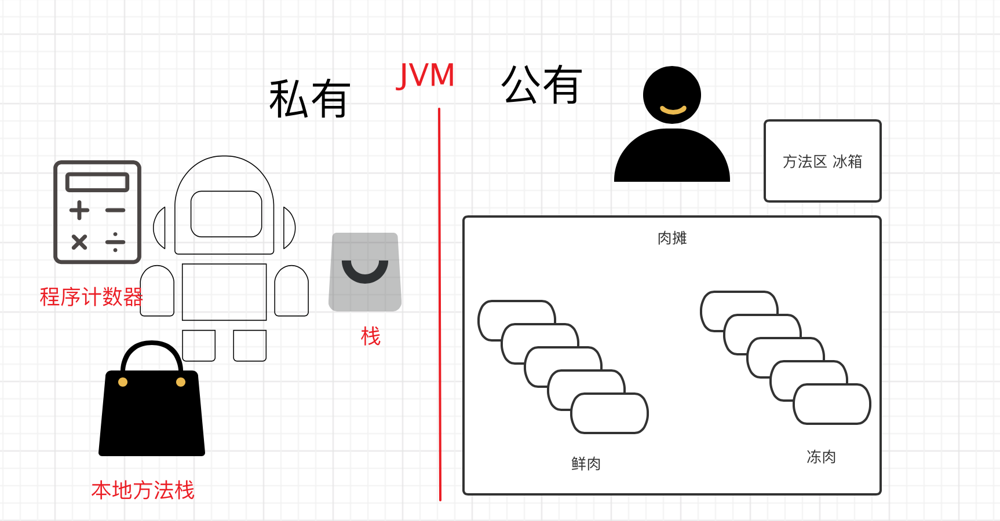
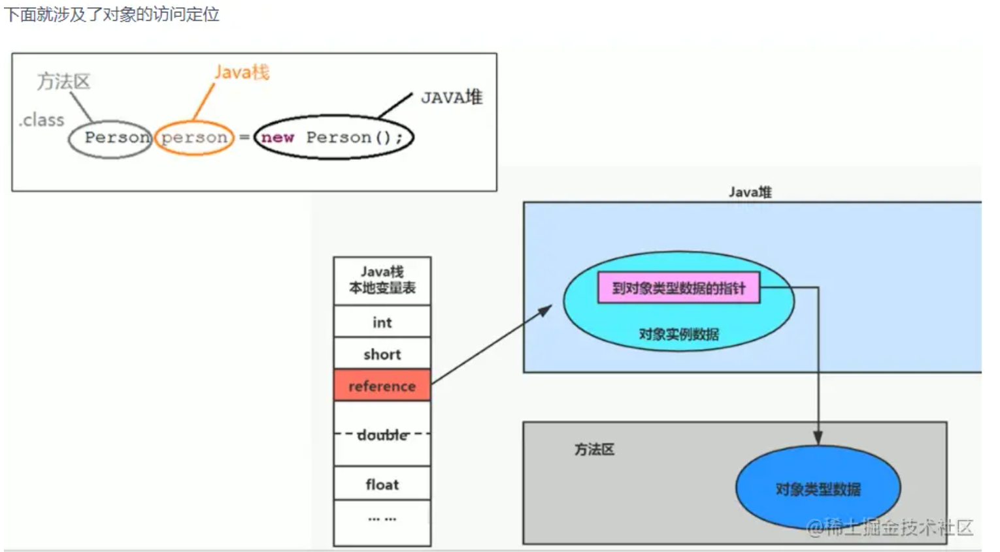
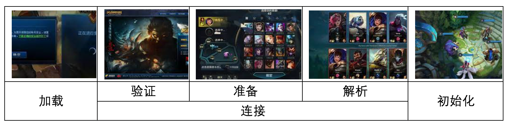
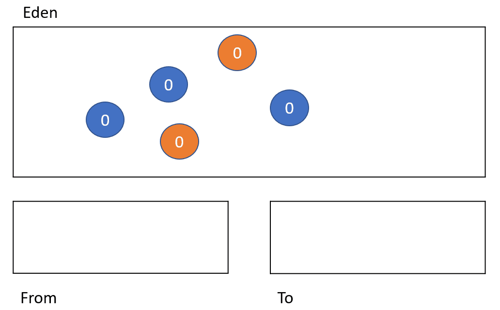

### JVM的位置

在操作系统之上，就是一个软件，相当于一个虚拟机


### JVM体系结构






### 类加载器

作用：加载class文件


1、类加载器收到类加载的请求

2、将这个请求委托给父类加载器进行加载，一直向上，指导启动类加载器

3、启动类加载器能加载就加载，不能加载就交给子类加载器加载。

形象记忆：小兵收到问题，先询问老大的意见，老大说我不处理你再处理，老大想处理就老大处理。

App->EXC->BOOT 

应用程序类加载器->扩展类加载器->启动类加载器。

native表示调用本地方法，就是底层方法。

### 双亲委派机制

```
当一个Hello.class这样的文件要被加载时。不考虑我们自定义类加载器，首先会在AppClassLoader中检查是否加载过，如果有那就无需再加载了。如果没有，那么会拿到父加载器，然后调用父加载器的loadClass方法。父类中同理也会先检查自己是否已经加载过，如果没有再往上。注意这个类似递归的过程，直到到达Bootstrap classLoader之前，都是在检查是否加载过，并不会选择自己去加载。直到BootstrapClassLoader，已经没有父加载器了，这时候开始考虑自己是否能加载了，如果自己无法加载，会下沉到子加载器去加载，一直到最底层，如果没有任何加载器能加载，就会抛出ClassNotFoundException。那么有人就有下面这种疑问了？
```

为什么

```
这种设计有个好处是，如果有人想替换系统级别的类：String.java。篡改它的实现，在这种机制下这些系统的类已经被Bootstrap classLoader加载过了（为什么？因为当一个类需要加载的时候，最先去尝试加载的就是BootstrapClassLoader），所以其他类加载器并没有机会再去加载，从一定程度上防止了危险代码的植入。
```

### 沙箱安全机制（了解）

### Native关键字

凡是带了navtive关键字的，表示java的作用范围达不到了，调用底层c语言的库。

会进入本地方法栈，会调用本地方法接口(JNI),（JNI）java native interface

JNI的作用，拓展JAVA的使用，兼容使用其他语言。例如java去调用打印机，去使用鼠标。

### 方法区

方法区存放的 static，final，Class（类模版，类的信息） ，常量池。

### 栈

先进后出，压酸菜

栈中，存放的是基本数据类型和**堆中对象的引用**，注意是引用，也就是说是地址。，也相当于整个方法（方法中包括局部变量等）压入栈。

### 对象实例化的过程

[对象实例化的过程](https://zhuanlan.zhihu.com/p/187016666)




### 堆

堆保存：类、方法、变量、常量。会出现OOM  outofmemory

堆分为以下几个区域：

新生区：类诞生的地方和成长的地方，伊甸园区是new对象的地方。

养老区：未被杀死的类存放的区域

元空间：存放运行时环境的区域，一般不用管。


如果出现OOM的话：**扩大堆内存空间**，如果还出现问题的话进行**内存分析**，用专业工具。

GC是垃圾回收的意思：分为轻GC和重GC(又叫full GC)


```
配置JVM的内存空间
-Xms1024m -Xmx1024m -XX:+PrintGCDetails
Xms设置初始化内存分配大小
Xmx设置最大分配内存
-XX:+PrintGCDetails//打印GC
-XX:+HeapDumpOnOutOfMemoryError//OOM Dump
```


### JPofilter工具分析OOM的原因

## GC的算法

### 复制算法


动图，就是把存活的对象，全部放到一个空的幸存区，把另外一个幸存区的存活对象也放到一起。让其中一个空出来，为下一次GC做准备。

好处：没有内存碎片，全部放在一起

缺点：浪费空间。


### 标记清除算法


### 标记清除压缩算法


### 总结

年轻代主要用标记复制算法

老年代主要用标记清除压缩算法。

# 分代收集


https://cloud.tencent.com/developer/article/1663822

新生代垃圾收集及内存分配

