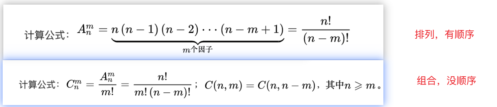
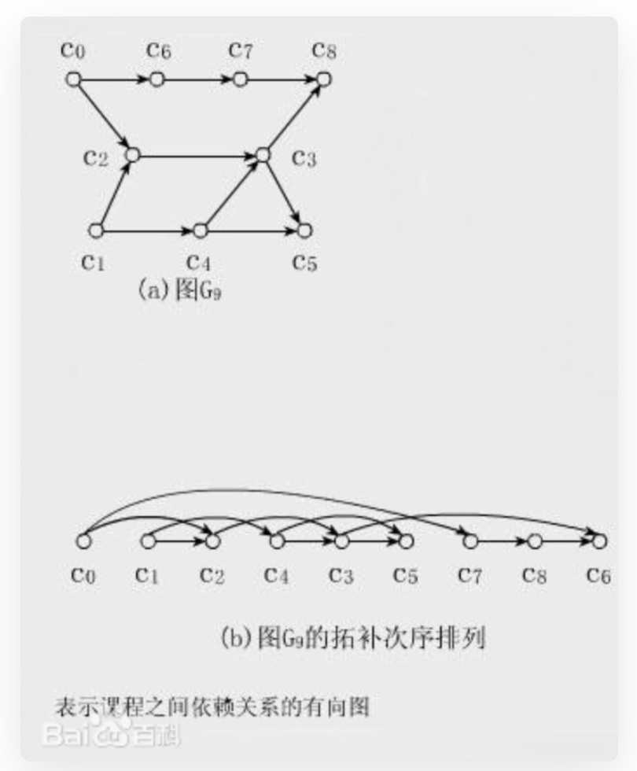

# 环检测算法

```java
ArrayList<ArrayList<Integer>> list=new ArrayList<>();
boolean hasCircle=false;
boolean[] isMarked;
boolean[] onStreat;
public boolean canFinish(int numCourses, int[][] prerequisites) {
  isMarked=new boolean[numCourses];
  onStreat=new boolean[numCourses];
  list=buildGraph(numCourses,prerequisites);
  //因为有可能不止一棵树
  for(int i=0;i<numCourses;i++){
    inversion(i);
  }
  return !hasCircle;
}
//建图函数
private ArrayList<ArrayList<Integer>> buildGraph(int num,int[][] kb){
  //就是当前节点的子节点是什么
  ArrayList<ArrayList<Integer>> graph=new ArrayList<>();
  for(int i=0;i<num;i++){
    graph.add(new ArrayList<>());
  }
  for(int i=0;i<kb.length;i++){
    graph.get(kb[i][0]).add(kb[i][1]);
  }
  return graph;
}
//检测以node为根节点的树是否有环。
private void inversion(int node){
  //先判断是否在路径上，来判断是否有环
  if(onStreat[node]){
    hasCircle=true;
    return;
  }
  //如果有环或者是被遍历过的就直接返回
  if(hasCircle||isMarked[node]){
    return;
  }
  //加入路线，相当于回溯
  onStreat[node]=true;
  //表示被遍历过了
  isMarked[node]=true;
  for(Integer i:list.get(node)){
    inversion(i);
  }
  //表示从路线上移除
  onStreat[node]=false;

}
```

# 拓扑排序，就是把图拉长



环检测算法的后续遍历就是拓扑排序的结果。

```java
private void inversion(int node){
  if(onStreat[node]){
    hasCircle=true;
    return;
  }
  if(hasCircle||isMarked[node]){
    return;
  }
  onStreat[node]=true;
  isMarked[node]=true;
  for(Integer i:list.get(node)){
    inversion(i);
  }
  //后续排序
  postorder.add(node);
  onStreat[node]=false;
}
```


# 判断是否为二分图

二分图就相当于，电影和演员的图，一个电影可能有很多的演员，一个演员可以演过多个电影，可以拉伸为左边是电影，右边是演员

```java
class Solution {
    boolean[] isMarked;
    int[][] list;
    boolean[] color;
    boolean res=true;
    public boolean isBipartite(int[][] graph) {
        isMarked=new boolean[graph.length];
        list=graph;
        //给每个节点涂颜色
        color=new boolean[graph.length];
        for(int i=0;i<graph.length;i++){
            reversion(i);
        }
        return res;

    }
    private void reversion(int node){
        //如果结果为false的话，直接返回。
        if(!res){
            return;
        }
        isMarked[node]=true;
        for(int neighbor:list[node]){
            //如果邻居节点没有被遍历过
            if(!isMarked[neighbor]){
                //把邻居节点颜色设置为当前节点颜色的反颜色
                color[neighbor]=!color[node];
                reversion(neighbor);
            }else{
                //如果邻居节点被遍历过，比较邻居节点和当前节点的颜色是否一致
                if(color[neighbor]==color[node]){
                    res=false;
                    return;
                }
            }
            

        }
        
    }
}
```


# UF并查集，就是连线，把不同的节点连起来


```java
class UF{
    //根节点数量
    private int count;
    private int[] parents;
    public UF(int n){
        parents=new int[n];
        for(int i=0;i<n;i++){
            parents[i]=i;
        }
        count=n;
    }
    public void connect(int m,int n){
        int rootm=root(m);
        int rootn=root(n);
        if(rootm==rootn){
            return ;
        }
        parents[rootm]=rootn;
        count--;
    }
    private int root(int m){
        while(parents[m]!=m){
            //m不跟这父亲过了，跟着爷爷过。
            parents[m]=parents[parents[m]];
            m=parents[m];
        }
        return m;
    }
    public boolean isConnected(int m,int n){
        if(root(m)==root(n)){
            return true;
        }else{
            return false;
        }
        //return root(m)==root(n);
    }
    public int count(){
        return count;
    }
}
```

# 最短路径，使用jk算法（1631题）

```java
class Solution {
    public int minimumEffortPath(int[][] heights) {
        return jk(heights);
        
    }
    private int jk(int[][] heights){
        int m=heights.length;
        int n=heights[0].length;
        int[][] distance=new int[m][n];
        for(int i=0;i<m;i++){
            Arrays.fill(distance[i],Integer.MAX_VALUE);
        }
        PriorityQueue<Node> queue=new PriorityQueue<>((a,b)->{
            return a.distance-b.distance;
        });
        distance[0][0]=heights[0][0];
        queue.add(new Node(0,0,heights[0][0]));
        while(!queue.isEmpty()){
            Node node=queue.poll();
            int x1=node.x;
            int y1=node.y;
            int newDistance=node.distance;
            if(x1==m-1&&y1==n-1){
                return newDistance;
            }
            if(newDistance>distance[x1][y1]){
                continue;
            }
            for(int[] around:neighbor(x1,y1,heights)){
                int ax=around[0];
                int ay=around[1];
                int nextDistance=distance[x1][y1]+heights[ax][ay];
                if(nextDistance<distance[ax][ay]){
                    //把distance更新了
                    distance[ax][ay]=nextDistance;
                    queue.add(new Node(ax,ay,nextDistance));
                }
                
            }

        }
        // for(int i=0;i<m;i++){
        //     for(int j=0;j<n;j++){
        //         System.out.print(distance[i][j]+":");
        //     }
        //     System.out.println("");
        // }
        return -1;
    }

    private List<int[]> neighbor(int x,int y,int[][] heights){
        int[][] n=new int[][]{{-1,0},{1,0},{0,-1},{0,1}};
        List<int[]> list=new ArrayList<>();
        for(int i=0;i<4;i++){
            int x1=x+n[i][0];
            int y1=y+n[i][1];
            if(x1<0||y1<0||x1>=heights.length||y1>=heights[0].length){
                continue;
            }else{
                list.add(new int[]{x1,y1});
            }
        }
        // for(int i=0;i<list.size();i++){
        //     System.out.println(Arrays.toString(list.get(i)));
        // }
        return list;
    }
}
class Node{
    int x;
    int y;
    int distance;
    public Node(int x,int y,int distance){
        this.x=x;
        this.y=y;
        this.distance=distance;
    }
}
```

