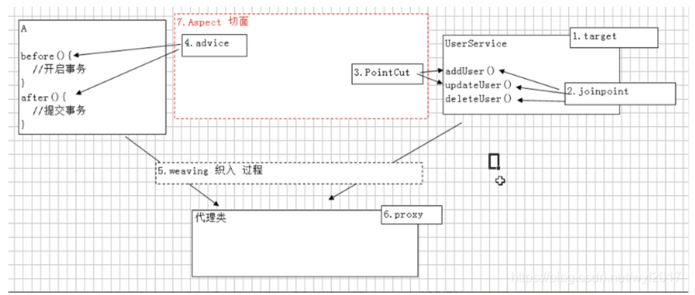

# 1、Spring下载

https://repo.spring.io/ui/native/release/org/springframework/spring

# Spring教程

https://www.w3cschool.cn/wkspring/pesy1icl.html

# Spring 的优良特性

- 非侵入式：基于Spring开发的应用中的对象可以不依赖于Spring的API

- 控制反转：IOC——Inversion of Control，指的是将对象的创建权交给 Spring 去创建。使用 Spring 之前，对象的创建都是由我们自己在代码中new创建。而使用 Spring 之后。对象的创建都是给了 Spring 框架。

- 依赖注入：DI——Dependency Injection，是指依赖的对象不需要手动调用 setXX 方法去设置，而是通过配置赋值。

- 面向切面编程：Aspect Oriented Programming——AOP

- 容器：Spring 是一个容器，因为它包含并且管理应用对象的生命周期

- 组件化：Spring 实现了使用简单的组件配置组合成一个复杂的应用。在 Spring 中可以使用XML和Java注解组合这些对象。

- 一站式：在 IOC 和 AOP 的基础上可以整合各种企业应用的开源框架和优秀的第三方类库（实际上 Spring 自身也提供了表现层的 SpringMVC 和持久层的 Spring JDBC）

  

# 2、IOC（inversion of control）

IOC控制反转，就是把对象的创建和调用交给Spring来管理。

IOC的底层原理是：xml解析、工厂模式、反射


[java反射](https://www.cnblogs.com/chanshuyi/p/head_first_of_reflection.html)**反射就是在运行时才知道要操作的类是什么，并且可以在运行时获取类的完整构造，并调用对应的方法。**

# 3、Spring提供IOC的两种实现方式（就是两个接口）

1. BeanFactory：IOC 容器基本实现，是 Spring 内部的使用接口，不提供开发人员进行使用 * 加载配置文件时候不会创建对象，在获取对象（使用）才去创建对象

2. ApplicationContext：BeanFactory 接口的子接口，提供更多更强大的功能，一般由开发人 员进行使用 * 加载配置文件时候就会把在配置文件对象进行创建
3. ApplicationContext接口两个的实现类


# 4、IOC的具体操作Bean

### 4.1、基于XML方式创建对象

id属性：id属性相当于宏定义，就是给复杂的字符串起个简单的别名；context.getBean(id,类.class);

class：类的全路径（包括包路径和类名）

注意：构造的时候是基于无参构造的方法。

### 4.2、基于XML方式注入属性（成员变量又叫做依赖）注入属性又叫做依赖注入

DI：DI就是注入属性

两种注入方法：第三种方法是使用注解进行注入。

1、使用set方法注入，在创建对象的时候就进行了属性注入。

```xml
<bean id="user" class="cn.njust.spring.Person">
<!--注意，name是使用set方法来设置属性值的，Pname就是表示向setPname中设置值为zhangsan-->
    <property name="Pname" value="zhangsan"></property>
</bean>
```

2、使用有参构造方法进行注入

```xml
id是在使用spring创建对象的时候要传入的参数，就是说要创建哪个对象，因为一个id对应一个类
<bean id="orders" class="cn.njust.spring.Order">
    <!--使用name还是使用index都是可以的-->
    <constructor-arg name="goods" value="iphone"/>
    <constructor-arg index="1" value="5999"/>
</bean>
```

3、两种方法的测试

```java
@Test
public void test2(){
  ClassPathXmlApplicationContext context = new ClassPathXmlApplicationContext("config.xml");
  Order orders = context.getBean("orders", Order.class);
  orders.show();
}
```

4、基于xml注入其他内容

```XML
使用set方法设置空值
<bean id="user" class="cn.njust.spring.Person">
  <!--注意，name是使用set方法来设置属性值的，Pname就是表示向setPname中设置值为null-->
  <property name="Pname">
    <null></null>
  </property>
</bean>
使用set方法设置特殊字符，可以使用转义字符
<bean id="user" class="cn.njust.spring.Person">
  <property name="Pname">
    <value>&quot;三国演义&quot;</value>
  </property>
</bean>
使用set方法注入其他类型的参数，如注入 实现类的对象，要使用ref属性。这是外部Bean，
<bean id="userServer" class="cn.njust.server.UserServer">
  <property name="name" value="张三"></property>
  <property name="userDao" ref="uesrDao"></property>
</bean>
<bean id="uesrDao" class="cn.njust.dao.UserDaoImpl"></bean>

也可以使用内部Bean，就是把ref去掉，在property中嵌套<bean></bean>
<bean id="userServer" class="cn.njust.server.UserServer">
  <property name="name" value="张三"></property>
  <property name="userDao">
    <bean id="uesrDao" class="cn.njust.dao.UserDaoImpl"></bean>
  </property>
</bean>

```

5、注入集合类型的属性（数组，list，set，map）

- 定义一个类，类中有四种类型的成员变量，数组，list，set，map。

- 写xml文件

```xml
<bean id="stuCollection" class="cn.njust.spring.StuCollection">
  <property name="array">
    <array>
      <value>array1</value>
      <value>array2</value>
      <value>array3</value>
    </array>
  </property>
  <property name="list">
    <list>
      <value>list1</value>
      <value>list2</value>
      <value>list3</value>
    </list>
  </property>
  <property name="map">
    <map>
      <entry key="key1" value="value1"></entry>
      <entry key="key2" value="value2"></entry>
      <entry key="key3" value="value3"></entry>
    </map>
  </property>
  <property name="set">
    <set>
      <value>set1</value>
      <value>set2</value>
      <value>set3</value>
    </set>
  </property>
</bean>
```

6、在集合 中设置对象类型值

就是集合中不再包含的是基本数据类型了，而是对象类型

```xml
<bean id="stuCollectionObj" class="cn.njust.spring.StuCollection">
  <property name="listCourse">
    <list>
      <ref bean="courseObj"></ref>
      <ref bean="courseObj1"></ref>
    </list>
  </property>
</bean>
<bean id="courseObj" class="cn.njust.spring.Course">
  <property name="cName" value="高数"></property>
</bean>
<bean id="courseObj1" class="cn.njust.spring.Course">
  <property name="cName" value="英语"></property>
</bean>
```

7、把集合注入部分进行提取

```XML
<?xml version="1.0" encoding="UTF-8"?>
<beans xmlns="http://www.springframework.org/schema/beans"
       xmlns:xsi="http://www.w3.org/2001/XMLSchema-instance"
       //自定义的命名空间
       xmlns:util="http://www.springframework.org/schema/util"  
       xsi:schemaLocation="http://www.springframework.org/schema/beans http://www.springframework.org/schema/beans/spring-beans.xsd
                           //自定义的命名空间
                           http://www.springframework.org/schema/util http://www.springframework.org/schema/util/spring-util.xsd">
    <util:list id="nameList">
        <value>张三</value>
        <value>李四</value>
        <value>王五</value>
    </util:list>
    <bean id="stuCollectionObj" class="cn.njust.spring.StuCollection">
        <property name="list" ref="nameList"></property>
    </bean>
</beans>
```

### 4.3、IOC操作Bean管理（普通Bean和工厂Bean）

- FactoryBean的类

```JAVA
public class FacBean implements FactoryBean<Course> {
    @Override
    public Course getObject() throws Exception {
        Course course = new Course();
        course.setcName("毛概");
        return course;
    }

    @Override
    public Class<?> getObjectType() {
        return null;
    }
}
```

- xml文件

```xml
<bean id="facBean" class="cn.njust.factoryBean.FacBean"></bean>
```

- 测试文件

```java
@Test
public void test7() {
  ClassPathXmlApplicationContext context = new ClassPathXmlApplicationContext("configCollection1.xml");
  Course course = context.getBean("facBean", Course.class);//注意此处与普通Bean的区别
  System.out.println(course.toString());
}
```

### 4.4、Bean的作用域

默认如果不对Spring进行配置的话是单实例对象，就是使用下面代码创建的对象`StuObj1`和`StuObj2`是同一个对象

```java
//singleton是在加载xml文件的时候就创建对象
ClassPathXmlApplicationContext context = new ClassPathXmlApplicationContext("configCollection.xml");//加载xml文件
//prototype是在调用getBean的时候才创建对象
StuCollection StuObj1 = context.getBean("stuCollectionObj", StuCollection.class);
StuCollection StuObj2 = context.getBean("stuCollectionObj", StuCollection.class);
```

设置为多实例的方法，设置scope属性的属性值（1、singleton单实例  2、prototype多实例）

```xml
<bean id="user" class="cn.njust.spring.Person" scope="prototype">
  <property name="Pname">
    <value>&quot;三国演义&quot;</value>
  </property>
</bean>
```

### 4.5、Bean的生命周期

1. 通过构造器创建bean实例(无参数构造)
2. 为bean的属性设置值和对其他bean引用(调用set方法)
3. 调用bean的初始化的方法(需要进行配置初始化的方法)
4. bean可以使用了(对象获取到了)
5. 当容器关闭时候,调用bean的销毁的方法(需要进行配置销毁的方法)

- 另外可以对Bean的生命周期加前置处理器和后置处理器（前置处理器会在初始化之前调用，后置处理器在初始化之后调用）

```java
//定义类
public class BeanLife {
    private String name;

    public BeanLife() {
        System.out.println("第一步：通过构造器创建bean实例");
    }

    public void setName(String name) {
        this.name = name;
        System.out.println("第二步：为bean的属性设置值");
    }
    public void initMethod(){
        System.out.println("第三步：调用bean的初始化的方法");
    }
    public void destroyMethod(){
        System.out.println("第五步：调用bean的销毁的方法");
    }
}
```

```xml
//配置xml
<bean id="beanLifeObj" class="cn.njust.spring.BeanLife" init-method="initMethod" destroy-method="destroyMethod">
  <property name="name" value="张书恒"></property>
</bean>
```

```java
//测试程序
//测试Bean的生命周期
@Test
public void test8() {
  ClassPathXmlApplicationContext context = new ClassPathXmlApplicationContext("life.xml");
  BeanLife beanLife = context.getBean("beanLifeObj", BeanLife.class);
  System.out.println("第四步：bean可以使用");
  context.close();//对Bean对象进行销毁，则它会执行destroyMethod
}
```

### 4.6、XML的自动装配（自动设置属性的值）

自动装配：根据指定规则，Spring自动将匹配的属性值进行注入

设置autowire="byName"或者"byType"，可以设置两种自动装配方式：根据属性名称注入（要求id名和属性名一致），根据属性类型注入（要起属性的类型和Bean的类型一致，且只有一个Bean）

### 4.7、引入外部文件

- 创建外部属性文件，创建properties文件

```properties
properties.sqlDriver=com.mysql.cj.jdbc.Driver
properties.url=jdbc:mysql://localhost:3306/database1
properties.user=root
properties.password=root1423
```

- 导包
- 新建context命名空间

- 把外部文件引入到spring配置文件中
- 属性注入

```xml
<?xml version="1.0" encoding="UTF-8"?>
<beans xmlns="http://www.springframework.org/schema/beans"
       xmlns:xsi="http://www.w3.org/2001/XMLSchema-instance"
       <!--新建context命名空间-->
       xmlns:context="http://www.springframework.org/schema/context"
       xsi:schemaLocation="http://www.springframework.org/schema/beans http://www.springframework.org/schema/beans/spring-beans.xsd
                           http://www.springframework.org/schema/context http://www.springframework.org/schema/context/spring-context.xsd">
  	<!--把外部文件引入到spring配置文件中-->
    <context:property-placeholder location="classpath:jdbc.properties"/>
    <bean id="druidDataSource" class="com.alibaba.druid.pool.DruidDataSource">
      	<!--属性注入-->
      	<property name="driverClassName" value="${properties.sqlDriver}"></property>
        <property name="url" value="${properties.url}"></property>
        <property name="username" value="${properties.user}"></property>
        <property name="password" value="${properties.password}"></property>
    </bean>
</beans>
```

### 4.8、基于注解方式的对象创建

Spring中创建对象提供注解，四个注解的功能是一致的，是为了在不同层中进行区分。

@Component组成部分

@Service服务

@Controller控制器

@Repository存储库

- 引入依赖

```
导入spring-aop-5.2.6.RELEASE.jar包
```

- 在xml中开启组件扫描，注意要新建context命名空间

```xml
<!--开启组件扫描，在加载此xml文件的时候，会到指定的目录下去扫描对应的类-->
<context:component-scan base-package="cn.njust.annotation"></context:component-scan>
```

- 在类中添加注解

value="userAnnotation"就相当于配置xml\<Bean\>的id="userAnnotation"

当只有value的时候`value=`可以省略

如果`(value="userAnnotaion")`省略的话则默认value等于类名首字母小写。

使用@Component和使用其它的三种注解方式是一样的。

```java
@Component(value="userAnnotation")
public class UserAnnotation {
    public void show(){
        System.out.println("基于注解方式对对象进行创建");
    }
}

```

```xml
<!--示例 1 use-default-filters="false" 表示现在不使用默认 filter，自己配置 filter context:include-filter ，设置扫描哪些内容 -->
<context:component-scan base-package="com.atguigu" use-default-filters="false">
<context:include-filter type="annotation"expression="org.springframework.stereotype.Controller"/>
</context:component-scan>

<!--示例 2 下面配置扫描包所有内容 context:exclude-filter： 设置哪些内容不进行扫描 -->
<context:component-scan base-package="com.atguigu">
<context:exclude-filter type="annotation"expression="org.springframework.stereotype.Controller"/>
</context:component-scan>
```

### 4.9、基于注解方式的属性注入

- @Autowired：根据属性类型进行自动装配，写在成员变量的上面

第一步： 把 service 和 dao 对象创建，在 service 和 dao 类添加创建对象注解（三个步骤，导包，开启组件扫描，添加注解）

第二步 ：在 service 注入 dao 对象，在 service 类添加 dao 类型属性，在属性上面使用Autowired注解，**此情况下默认扫描的此属性的对象要唯一。**

```java
@Service   //service层的对象
public class UserAnnotation {
    @Autowired
    private UserDao userDao;
    public void show(){
        System.out.println("基于注解方式对 对象进行创建");
        userDao.userName();
    }
}
```

- @Qualifier：根据名称进行注入（这个@Qualifier 注解的使用，和上面@Autowired 一起使用）

```java
@Autowired //根据类型进行注入 
@Qualifier(value = "userDaoImpl1") //根据名称进行注入，userDaoImpl上要使用注解@Repository(value = "userDaoImpl1") 
private UserDao userDao;
```

- @Resource：可以根据类型注入，可以根据名称注入

```java
//@Resource//根据类型进行注入
//根据名称注入
@Resource(name = "userDaoImpl1") 
private UserDao userDao;
```

- @Value：注入普通类型属性

```java
@Value(value = "abc") 
private String name;
```

### 4.10、完全注解开发

就是用注解的类来代替XML文件来实现注解开发，其实SpringBoot就是这样的方式。

- 创建配置类，替代 xml 配置文件

```java
@Configuration //作为配置类，替代 xml 配置文件 
@ComponentScan(basePackages = {"com.atguigu"}) 
public class SpringConfig { 
}
```

- 编写测试类

```java
@Test 
public void testService2() {
  ApplicationContext context = new AnnotationConfigApplicationContext(SpringConfig.class); //使用AnnotationConfigApplicationContext加载配置类，其他的不变。
  UserService userService = context.getBean("userService", UserService.class);
  System.out.println(userService); 
  userService.add(); 
}
```

# 5、AOP面向切面编程

Aspect Oriented Programming（AOP）不修改源代码的方式，在主干功能里添加新的功能。使用动态代理的原因是：可以代理不同的接口，接口的方法名不同，如果使用静态代理的话要多每一个接口创建一个静态代理类，不通用。

AOP底层使用动态代理来实现：有接口的情况下，创建接口实现类的代理对象（JDK动态代理）。没有接口的情况下，创建子类的代理对象。

### 5.1、JDK动态代理

1、使用Proxy类的newProxyInstance方法创建接口实现类的代理对象

见IDE代码

### 5.2、术语

**连切通**



2、连接点

类里面哪些方法可以被增强,这些方法称为连接点

3、切入点

实际被真正增强的方法(可以是一个或者多个),称为切入点

```java
@Before(value = "execution(* cn.njust.aop.Students.*(..))")//多个
@Before(value = "execution(* cn.njust.aop.Students.add(..))")//一个
```

4、通知(增强)

（1）实际增强的逻辑部分称为通知(增强)

（2）通知有多钟类型 ：前置通知 后置通知 环绕通知 异常通知 最终通知

7、切面（是代理类）

切面（Aspect） 切面是通知和切入点的结合

```java
//这就是一个切面
/*
@Before(value = "execution(* cn.njust.aop.Students.*(..))")
public void before() {
  System.out.println("前置通知：班长通知说交学费了");
}
*/
```


### 5.3、AOP操作

Spring框架一般是基于AspectJ实现AOP操作

两种实现方式：1、基于xml方式实现，2、基于注解方式实现。

- 需要导包，导入依赖。AspectJ的四个依赖。
- 

### 5.4、切入点表达式

知道对哪个类中的哪个方法进行增强

```
execution([权限修饰符][返回值类型][类的全路径名][方法]([参数列表]))
```

### 5.5、AOP操作流程（使用注解）

- 创建被代理类

```java
//被代理类
@Component
//如果不写value等于的话，默认（value="students"）
public class Students {
    public void add() {
        System.out.println("上交学费");
    }
}

```

- 创建代理类，编写增强逻辑，就是创建不同的方法，代表不同的通知类型。

```java
//代理类，也就是班长类
@Component
@Aspect//生成代理对象，aspect方面，就是方方面面都给你代理好了。
public class ProxyStudents {
    //使用注解Before，标记此方法是被代理对象的前置通知,value=切入点表达式,切入点就是被代理的方法
    @Before(value = "execution(* cn.njust.aop.Students.add(..))")
    public void before() {
        System.out.println("班长通知说交学费了");
    }
}
```

- 进行通知的配置

  - 在spring配置文件中开启注解扫描

    - ```java
      <!--开启注解扫描，扫面cn.njust.aop包下的注解-->
      <context:component-scan base-package="cn.njust.aop"></context:component-scan>
      如果不自动扫描的话，需要手动加载bean
      <bean name="myAspect" class="cn.xh.dao. MyAspectLog "/>
      ```
  
  - 使用注解创建代理类和被代理类的对象（就是在类的前面加@Component@Service@Controller@Repository中的一个）
  
  - 在代理类前面添加注解@Aspect
  
  - 在 spring 配置文件中开启生成代理对象，就是加上这一句话
  
    - ```java
      <!--在 spring 配置文件中开启生成代理对象，就是开启@AspectJ 支持-->
      <aop:aspectj-autoproxy></aop:aspectj-autoproxy>
      ```
  
  - 配置不同类型的通知
  
    ```java
    @Component 
    @Aspect //生成代理对象（生成一个切面） 
    public class UserProxy { 
      //前置通知 
      //@Before 注解表示作为前置通知 （切入点）
      @Before(value = "execution(* com.atguigu.spring5.aopanno.User.add(..))") 
      public void before() { 
        System.out.println("before........."); 
      } 
      //后置通知（返回通知）（通知） 
      @AfterReturning(value = "execution(* com.atguigu.spring5.aopanno.User.add(..))") 
      public void afterReturning() { 
        System.out.println("afterReturning........."); 
      } 
      //最终通知 ，相当于finally最终都会执行。
      @After(value = "execution(* com.atguigu.spring5.aopanno.User.add(..))") 
      public void after() { 
        System.out.println("after........."); 
      } 
      //异常通知 
      @AfterThrowing(value = "execution(* com.atguigu.spring5.aopanno.User.add(..))") 
      public void afterThrowing() { 
        System.out.println("afterThrowing........."); 
      } 
      //环绕通知 
      @Around(value = "execution(* com.atguigu.spring5.aopanno.User.add(..))") 
      public void around(ProceedingJoinPoint proceedingJoinPoint) throws Throwable { 
        System.out.println("环绕之前........."); 
        //被增强的方法执行 
        proceedingJoinPoint.proceed(); 
        System.out.println("环绕之后........."); 
      } 
    }
    
    
    try{
        try{
            //@Before
            method.invoke(..);
        }finally{
            //@After
        }
        //@AfterReturning
    }catch(){
        //@AfterThrowing
    }
    
    ```

### 5.6、相同的切入点抽取

```java
//首先定义一个方法，使用Pointcut注解，进行相同切入点的抽取
@Pointcut(value = "execution(* com.atguigu.spring5.aopanno.User.add(..))")
public void pointdemo() {
}
//然后在切入点的value值等于上面定义的方法。
//@Before 注解表示作为前置通知
@Before(value = "pointdemo()") 
public void before() { 
  System.out.println("before........."); 
}
```

### 5.7、设置增强类优先级 

有多个增强类（代理类）对同一个方法进行增强，设置增强类优先级 

在增强类上面添加注解 @Order(数字类型值)，数字类型值越小优先级越高

```java
@Component //基于注解的方式创建对象。
@Aspect //自动代理
@Order(1) //设置代理类的优先级
public class PersonProxy{
  
}
```

### 5.8、完全使用注解开发 

创建配置类，不需要创建 xml 配置文件 

```java
@Configuration //表示是一个配置类
@ComponentScan(basePackages = {"com.atguigu"}) //开启组件扫描
@EnableAspectJAutoProxy(proxyTargetClass = true) 
//等于在 spring 配置文件中开启生成代理对象的代码
//<aop:aspectj-autoproxy></aop:aspectj-autoproxy>
public class ConfigAop { 
}


```

### 5.9、AOP操作流程（使用xml配置文件）

1、创建两个类，增强类和被增强类，创建方法

 2、在 spring 配置文件中创建两个类对象

```xml
<!--创建对象-->
<bean id="book" class="com.atguigu.spring5.aopxml.Book"></bean>
<bean id="bookProxy" class="com.atguigu.spring5.aopxml.BookProxy"></bean>
```

3、在 spring 配置文件中配置切入点

```xml
<!--配置 aop 增强-->
<aop:config>
  <!--切入点-->
  <aop:pointcut id="p" expression="execution(* com.atguigu.spring5.aopxml.Book.buy(..))"/>
  <!--配置切面-->
  <aop:aspect ref="bookProxy">
    <!--增强作用在具体的方法上-->
    <aop:before method="before" pointcut-ref="p"/>
  </aop:aspect>
</aop:config>
```

# 6、JDBCTemplate

什么是 JdbcTemplate ：Spring 框架对 JDBC 进行封装，使用 JdbcTemplate 方便实现对数据库操作

### 6.1、JDBCTemplate的创建流程

- 引入依赖，注意有时候要添加最新版本的依赖


- 在 spring 配置文件配置数据库连接池

```xml
<!-- 数据库连接池 -->
<!-- 就是创建了一个class类的对象，对象名为dateSource，并且成员变量名为name的成员变量值为value -->
<bean id="dataSource" class="com.alibaba.druid.pool.DruidDataSource"destroy-method="close">
  <property name="url" value="jdbc:mysql:///user_db" />
  <property name="username" value="root" />
  <property name="password" value="root" />
  <property name="driverClassName" value="com.mysql.jdbc.Driver" />
</bean>
```

- 配置 JdbcTemplate 对象，把上面的DataSource进行注入。

```xml
<!-- JdbcTemplate 对象 --> <!--注入 dataSource-->
<bean id="jdbcTemplate" class="org.springframework.jdbc.core.JdbcTemplate">
	<property name="dataSource" ref="dataSource"></property>
</bean>

```

- 创建 service 类，并注入dao类对象。创建 dao 类，并注入 jdbcTemplate 对象

1. xml配置文件中开启组件扫描

```xml
<!--不要忘了开启组件扫描-->
<context:component-scan base-package="cn.njust.jdbc"></context:component-scan>
```

2. BookDao接口的实现类

```java
//通过注解的方法创建对象，省略value则对象名为类名首字母小写
@Repository
public class BookDaoImpl implements BookDao {
    //自动属性注入
    @Autowired
    private JdbcTemplate jdbcTemplate;
}
```

3. BookService类

```java
//使用注解方法创建对象
@Service
public class BookService {
    //使用注解方法进行属性注入
    @Autowired
    //@Autowired会通过组件扫描，然后根据类型自动进行属性注入，
    private BookDao bookDao;
}
```

### 6.2、使用JDBCTemplate对数据库进行操作

- 创建对应的实体类

```java
//并生成对应的get和set方法
public class Book {
    private int bookId;
    private String bookName;
    private int bookPrice;
}
```

- 编写 service 和 dao

1. 在dao接口中添加add方法

```java
public void add(Book book);
```

2. 在dao接口实现类中实现实现add方法

```java
//对BookDao接口的方法进行底层实现
@Override
public void add(Book book) {
  String sql="insert into book values(?,?,?)";
  Object[] args={book.getBookId(),book.getBookName(),book.getBookPrice()};
  //使用update方法进行插入数据
  int numsEffected = jdbcTemplate.update(sql, args);
  System.out.println(numsEffected);
}
```

3. 在service类中添加一个方法，调用dao接口中的add类

```java
//server层的add方法
public void addBook(Book book){
  //调用成员变量bookDao的add方法进行添加。bookDao底层操作在实现类中操作
  bookDao.add(book);
}
```

4. 测试

```java
@Test
public void testAdd(){
    ClassPathXmlApplicationContext context = new ClassPathXmlApplicationContext("jdbc1.xml");
    BookService bookService = context.getBean("bookService", BookService.class);
    Book book = new Book(1, "三国演义", 99);
    bookService.addBook(book);
}
```

5. 另外使用JDBCTemplate对数据库进行修改和删除。

与添加同理。出了sql语句的不同而已

```java
//修改
String sql="update book set price=? where id=?";
//删除
String sql="delete from book where id=?";
```

### 6.3、JDBCTemplate查询数据库

- 查询返回某个值

```java
Integer result = jdbcTemplate.queryForObject(sql, Integer.class);
```

- 查询返回对象

```java
//注意在Book类中添加空参构造函数。返回的值会封装到Book类中。因此类中要有对象的   set字段  的方法，才会自动封装。
Book book = jdbcTemplate.queryForObject(sql, new BeanPropertyRowMapper<>(Book.class), id);
```

- 查询返回集合

```java
//返回的值会封装到Book类中。，返回列表要用query方法查询。
List<Book> list = jdbcTemplate.query(sql, new BeanPropertyRowMapper<Book>(Book.class));
```

### 6.4、JDBCTemplate批量添加

```java
//批量添加使用batchUpdate方法，第二个参数是List<>类型的数据。
@Override
public void addList(List<Object[]> books) {
    String sql="insert into book values(?,?,?)";
    int[] ints = jdbcTemplate.batchUpdate(sql, books);
    System.out.println(Arrays.toString(ints));
}
```

### 6.5、JDBCTemplate批量修改

```java
@Override
public void updateList(List<Object[]> books) {
  String sql="update book set price=? where id=?";
  int[] ints = jdbcTemplate.batchUpdate(sql, books);
  System.out.println(Arrays.toString(ints));
}
//注意测试的时候，输入的参数要注意顺序跟sql中问号的顺序一致
List<Object[]> books = new ArrayList<>();
Object[] b1 = {123, 1};
Object[] b2 = {123, 5};
books.add(b1);
books.add(b2);
bookService.updateBooks(books);
```

### 6.6、JDBCTemplate批量删除

```java
String sql="delete from book where id=?";
int[] ints = jdbcTemplate.batchUpdate(sql, books);
@Test
List<Object[]> books = new ArrayList<>();
Object[] b1 = {4};
Object[] b2 = {5};
books.add(b1);
books.add(b2);
bookService.deleteBooks(books);
```

# 7、事务操作

### 7.1、事务操作环境的搭建

1. 创建数据表，添加数据
2. 创建service和dao，分别负责逻辑操作层和数据库操作层。

dao的实现类

```JAVA
@Repository
public class UserDaoImpl implements UserDao {
    //自动属性输入，就是定义一个成员变量，成员变量的值是根据属性自动注入的
    @Autowired
    private JdbcTemplate jdbcTemplate;
    @Override
    public void addMoney() {
        String sql="update account_demo set balance=balance+? where username=?";
        Object[] args={100,"zhangsan"};
        int update = jdbcTemplate.update(sql, args);
        if(update>0){
            System.out.println(args[1]+"：成功转入"+args[0]+"元");
        }
    }

    @Override
    public void reduceMoney() {
        String sql="update account_demo set balance=balance-? where username=?";
        Object[] args={100,"lisi"};
        int update = jdbcTemplate.update(sql, args);
        if(update>0){
            System.out.println(args[1]+"：成功转出"+args[0]+"元");
        }
    }
}

```

service层的类

```java
@Service
public class UserService {
    @Autowired
    private UserDao userDao;

    public void transactionAccount(){
        //转出钱
        userDao.reduceMoney();
        //手动设置错误，来验证事务
        //int a=10/0;
        //转入钱
        userDao.addMoney();
    }
}
```

对象注入

```java
<?xml version="1.0" encoding="UTF-8"?>
<!--新建context命名空间-->
<beans xmlns="http://www.springframework.org/schema/beans"
       xmlns:xsi="http://www.w3.org/2001/XMLSchema-instance"
       xmlns:context="http://www.springframework.org/schema/context"
       xsi:schemaLocation="http://www.springframework.org/schema/beans http://www.springframework.org/schema/beans/spring-beans.xsd
                           http://www.springframework.org/schema/context http://www.springframework.org/schema/context/spring-context.xsd">
    <!--引入外部文件-->
    <context:property-placeholder location="classpath:jdbc.properties"/>
    <!--创建对象-->
    <bean id="druidDataSource" class="com.alibaba.druid.pool.DruidDataSource">
        <!--属性注入-->
        <property name="driverClassName" value="${properties.sqlDriver}"></property>
        <property name="url" value="${properties.url}"></property>
        <property name="username" value="${properties.user}"></property>
        <property name="password" value="${properties.password}"></property>
    </bean>
    <!--配置 JdbcTemplate 对象，注入 DataSource，这就创建好一个jdbcTemplate对象了-->
    <bean id="jdbcTemplate" class="org.springframework.jdbc.core.JdbcTemplate">
        <!--使用set的方法进行属性注入-->
        <property name="dataSource" ref="druidDataSource"></property>
    </bean>
    <!--开启组件扫描，会扫描base-package路径下的使用注解创建的类的对象-->
    <context:component-scan base-package="cn.njust.transaction"></context:component-scan>
</beans>
```

3. 测试

### 7.2、事务管理介绍

在 Spring 进行事务管理操作有两种方式：编程式事务管理和声明式事务管理（推荐）

声明式事务管理 包括：1、基于注解方式（推荐） 2、 基于 xml 配置文件方式

在 Spring 进行声明式事务管理，底层是使用 AOP 原理

Spring 事务管理 API，提供一个接口`PlatformTransactionManager`，代表**事务管理器**，这个接口针对不同的框架提供不同的实现类


### 7.3、基于注解方式的事务管理

- 在xml中创建事务管理器（PlatformTransactionManager接口的实现类(使用JDBC的时候使用DataSourceTransactionManager的实现类)对象）

```xml
<!--创建事务管理器对象-->
<bean class="org.springframework.jdbc.datasource.DataSourceTransactionManager" id="dataSourceTransactionManager">
  <property name="dataSource" ref="druidDataSource"></property>
</bean>
```

- 在 spring 配置文件，开启事务注解

  - 在xml中引入tx命名空间，一共要改五个地方

    ```xml
    xmlns:tx="http://www.springframework.org/schema/tx"
    		xsi:schemaLocation="http://www.springframework.org/schema/tx http://www.springframework.org/schema/tx/spring-tx.xsd">
    ```

  - 开启事务注解

    ```xml
    <!--开启事务注解-->
    <tx:annotation-driven transaction-manager="dataSourceTransactionManager"></tx:annotation-driven>
    ```

    

- 在service类上添加事务注解（@Transactional），或者在类的方法上添加事务注解

### 7.4、基于注解的事务管理的参数配置）

在类上面添加注解@Transactional，在这个注解里面可以配置事务相关参数


1、propagation：事务传播行为，表示多个事务之间相互调用的情况下，或者有事务注解的调用没有事务注解的方法，或者没有注解的方法调用有事务注解的方法

什么叫事务传播行为？听起来挺高端的，其实很简单。
`即然是传播，那么至少有两个东西，才可以发生传播。单体不存在传播这个行为。`

`事务传播行为（propagation behavior）指的就是当一个事务方法被另一个事务方法调用时，这个事务方法应该如何进行。`
例如：methodA事务方法调用methodB事务方法时，methodB是继续在调用者methodA的事务中运行呢，还是为自己开启一个新事务运行，这就是由methodB的事务传播行为决定的。


Spring事务传播行为有7种，主要了解下面的两种（@Transactional(propagation=REQUIRED)）

```
关于propagation属性的7个传播行为
REQUIRED：指定当前方法必需在事务环境中运行，如果当前有事务环境就加入当前正在执行的事务环境，如果当前没有事务，就新建一个事务。这是默认值。 
SUPPORTS：指定当前方法加入当前事务环境，如果当前没有事务，就以非事务方式执行。 
MANDATORY：指定当前方法必须加入当前事务环境，如果当前没有事务，就抛出异常。
REQUIRES_NEW：指定当前方法总是会为自己发起一个新的事务，如果发现当前方法已运行在一个事务中,则原有事务被挂起,我自己创建一个属于自己的事务,直我自己这个方法commit结束,原先的事务才会恢复执行。
NOT_SUPPORTED：指定当前方法以非事务方式执行操作，如果当前存在事务，就把当前事务挂起，等我以非事务的状态运行完，再继续原来的事务。
NEVER：指定当前方法绝对不能在事务范围内执行，如果方法在某个事务范围内执行，容器就抛异常，只有没关联到事务，才正常执行。
NESTED：指定当前方法执行时，如果已经有一个事务存在,则运行在这个嵌套的事务中.如果当前环境没有运行的事务，就新建一个事务，并与父事务相互独立，这个事务拥有多个可以回滚的保证点。就是指我自己内部事务回滚不会对外部事务造成影响，只对DataSourceTransactionManager事务管理器起效。
```


2、ioslation：事务隔离级别，

多个用户并发访问数据库时，一个用户的事务不能被其他用户的事务所干扰，多个并发事务之间数据要相互隔离。如果不考虑隔离性，会引发安全问题如下：脏读、不可重复读、幻读（虚读）。

**脏读**（读到了被撤回的数据）：一个事务读取了另一个事务改写但还未提交的数据，如果这些数据被回滚，则读到的数据是无效的。

**不可重复读**（意思就是每次读到的数据有可能不一样，就是不可以重复读到同样的数据，好像是看错了）：在同一事务中，多次读取同一数据返回的结果有所不同，读到了之前的数据后又读到了其他事务已经提交的更新的数据。

**幻读（虚读）**（好像是读到了之前漏读的消息，读到的数据的数量不一样）：一个事务读取了几行记录后，另一个事务插入（insert）一些记录幻读就发生了。再后来的查询中，第一个事务就会发现有些原来没有的记录。


3、timeout：超时时间 

（1）事务需要在一定时间内进行提交，如果不提交进行回滚 

（2）默认值是 -1 ，设置时间以秒单位进行计算

4、readOnly：是否只读 

（1）读：查询操作，写：添加修改删除操作 

（2）readOnly 默认值 false，表示可以查询，可以添加修改删除操作 

（3）设置 readOnly 值是 true，设置成 true 之后，只能查询

5、rollbackFor：回滚 

（1）设置出现哪些异常进行事务回滚

6、noRollbackFor：不回滚 

（1）设置出现哪些异常不进行事务回滚

### 7.5、完全注解开发（使用配置类代替xml配置文件）

```java
package cn.njust.transaction.config;

import com.alibaba.druid.pool.DruidDataSource;
import org.springframework.context.annotation.Bean;
import org.springframework.context.annotation.ComponentScan;
import org.springframework.context.annotation.Configuration;
import org.springframework.jdbc.core.JdbcTemplate;
import org.springframework.jdbc.datasource.DataSourceTransactionManager;
import org.springframework.transaction.TransactionManager;
import org.springframework.transaction.annotation.EnableTransactionManagement;

import javax.sql.DataSource;

/**
 * @Classname cn.njust.transaction.config
 * @Date 2021/12/18 3:53 下午
 * @Created by Zhang Shuheng
 * @Description 这是Tx（根据transaction发音来进行的缩写）的配置类，使用完全注解开发的方式，就是不使用xml配置文件使用配置类
 */

@Configuration//配置类的注解，表示是一个配置类
@ComponentScan(basePackages =  "cn.njust.transaction")//开启组件扫描
@EnableTransactionManagement//开启事务
public class TxConfig {
    //1。创建数据库连接池，注意加@Bean
    @Bean
    public DruidDataSource getDruidDataSource() {
        DruidDataSource dataSource = new DruidDataSource();
        dataSource.setDriverClassName("com.mysql.cj.jdbc.Driver");
        dataSource.setUrl("jdbc:mysql://localhost:3306/database1");
        dataSource.setUsername("root");
        dataSource.setPassword("root1423");
        return dataSource;
    }

    //2.创建JdbcTemplate对象，到 ioc 容器中根据类型找到 dataSource
    @Bean
    public JdbcTemplate getJdbcTemplate(DataSource dataSource) {
        JdbcTemplate jdbcTemplate = new JdbcTemplate();
        jdbcTemplate.setDataSource(dataSource);
        return jdbcTemplate;
    }

    //3。创建事务管理器
    @Bean
    public DataSourceTransactionManager getDataSourceTransactionManager(DataSource dataSource) {
        DataSourceTransactionManager transactionManager = new DataSourceTransactionManager();
        transactionManager.setDataSource(dataSource);
        return transactionManager;
    }
}

```

测试

```java
//测试完全注解开发，来进行事务的处理
@Test
public void transactionTest2() {
  AnnotationConfigApplicationContext context = new AnnotationConfigApplicationContext(TxConfig.class);//注意不要加双引号
  UserService userService = context.getBean("userService", UserService.class);
  userService.transactionAccount();
}
```

# 8、Spring5新特性

### 1、整个 Spring5 框架的代码基于 Java8

### 2、在Spring5 框架整合 Log4j2，同时框架也自带了通用的日志封装

1、引入jar包


2、创建xml配置文件，注意文件名只能使用log4j2.xml

```xml
<?xml version="1.0" encoding="UTF-8"?>
<!--日志级别以及优先级排序: OFF > FATAL > ERROR > WARN > INFO > DEBUG > TRACE > ALL -->
<!--Configuration后面的status用于设置log4j2自身内部的信息输出，可以不设置，当设置成trace时，可以看到log4j2内部各种详细输出-->
<configuration status="INFO">
    <!--先定义所有的appender-->
    <appenders>
        <!--输出日志信息到控制台-->
        <console name="Console" target="SYSTEM_OUT">
            <!--控制日志输出的格式-->
            <PatternLayout pattern="%d{yyyy-MM-dd HH:mm:ss.SSS} [%t] %-5level %logger{36} - %msg%n"/>
    </console>
    </appenders>
    <!--然后定义logger，只有定义了logger并引入的appender，appender才会生效-->
    <!--root：用于指定项目的根日志，如果没有单独指定Logger，则会使用root作为默认的日志输出-->
    <loggers>
        <root level="info">
            <appender-ref ref="Console"/>
        </root>
    </loggers>
</configuration>
```

3、在运行程序的时候控制台就会有日志输出

### 3、Spring5 框架核心容器支持@Nullable 注解 

（1）@Nullable 注解可以使用在**方法**上面，**属性**上面，参数上面，表示方法返回可以为空，属性值可以为空，参数值可以为空


### 4、Spring5 核心容器支持函数式风格 GenericApplicationContext

```java
//函数式风格创建对象，交给 spring 进行管理
@Test 
public void testGenericApplicationContext() {
  //1 创建 GenericApplicationContext 对象
  GenericApplicationContext context = new GenericApplicationContext();
  //2 调用 context 的方法对象注册
  context.refresh(); context.registerBean("user1",User.class,() -> new User());
  //3 获取在 spring 注册的对象
  // User user = (User)context.getBean("com.atguigu.spring5.test.User");
  User user = (User)context.getBean("user1"); System.out.println(user);
}
```

### 5、在Spring5 中整合 JUnit4

- 引入依赖


- 创建测试类，使用注解方式完成

```java
package cn.njust.transaction.test;

import cn.njust.transaction.service.UserService;
import org.junit.Test;
import org.junit.runner.RunWith;
import org.springframework.beans.factory.annotation.Autowired;
import org.springframework.test.context.ContextConfiguration;
import org.springframework.test.context.junit4.SpringJUnit4ClassRunner;

@RunWith(SpringJUnit4ClassRunner.class)//单元测试框架
//相当于ClassPathXmlApplicationContext context = new ClassPathXmlApplicationContext("transaction.xml");
@ContextConfiguration("classpath:transaction.xml")//加载配置文件，注意在加载配置文件的时候，注释掉完全注解开发的config类
public class TestJunit4 {
    //相当于UserService userService = context.getBean("userService", UserService.class);
    @Autowired
    private UserService userService;

    @Test
    public void test1(){
        userService.transactionAccount();
    }
}
```

### 6、在Spring5中整合JUnit5

-  引入 JUnit5 的 jar 包


- 创建测试类，使用注解完成

```java
@ExtendWith(SpringExtension.class)
@ContextConfiguration("classpath:transaction.xml")
public class TestJunit5 {
    //相当于UserService userService = context.getBean("userService", UserService.class);
    @Autowired
    private UserService userService;

    @Test
    public void test1(){
        userService.transactionAccount();
    }
}
```

- 使用一个复合注解替代上面两个注解完成整合

```java
//@ExtendWith(SpringExtension.class)
//@ContextConfiguration("classpath:transaction.xml")
@SpringJUnitConfig(locations = "classpath:transaction.xml")
```

# 9、框架新功能（Webflux）


### 9.1、异步非阻塞

解释什么是异步非阻塞 

- 异步和同步 
- 非阻塞和阻塞 

上面都是针对对象不一样

异步和同步针对调用者，调用者发送请求，如果等着对方回应之后才去做其他事情就是同步，如果发送请求之后不等着对方回应就去做其他事情就是异步

阻塞和非阻塞针对被调用者，被调用者收到请求之后，做完请求任务之后才给出反馈就是阻塞，受到请求之后马上给出反馈然后再去做事情就是非阻塞

阻塞需要等待，非阻塞不需要等待

### 9.2、Webflux 特点： 

第一 非阻塞式：在有限资源下，提高系统吞吐量和伸缩性，以 Reactor 为基础实现响应式编程。响应式编程就是我正常干我的活，等到你有请求的时候我就处理你的指令，不是在这干等着。

第二 函数式编程：Spring5 框架基于 java8，Webflux 使用 Java8 函数式编程方式实现路由请求

### 9.3、Webflux比较 SpringMVC


第一 两个框架都可以使用注解方式，都运行在 Tomet 等容器中 

第二 SpringMVC 采用命令式编程，Webflux 采用异步响应式编程

# 待学习

