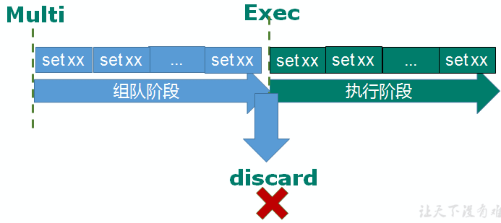

# redis

redis的事务

multi命令开启事务

然后输入redis指令

输入完毕输入Exec执行

### redis的事物的三个特征

- 单独的隔离操作 
  - 事务中的所有命令都会序列化、按顺序地执行。事务在执行的过程中，不会被其他客户端发送来的命令请求所打断。 
- 没有隔离级别的概念 
  - 队列中的命令没有提交之前都不会实际被执行，因为事务提交前任何指令都不会被实际执行
- 不保证原子性 
  - 事务中如果有一条命令执行失败，其后的命令仍然会被执行，没有回滚

### WATCH key [key ...]

在执行multi之前，先执行watch key1 [key2],可以监视一个(或多个) key ，如果在事务执行之前这个(或这些) key 被其他命令所改动，那么事务将被打断。